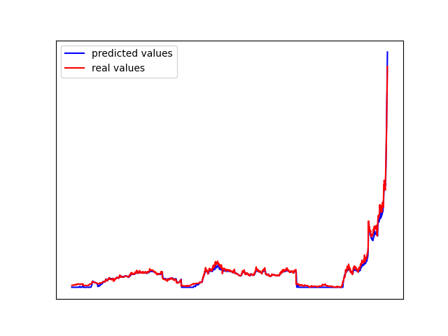
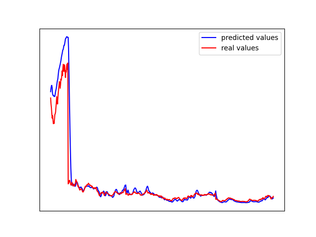

# CNN_stock
A simple deep neural network based on CNNs to predict the growth slope of a stock in Tehran Stock Exchange.
It first trains the model on historical data of the given stock and then predicts the the growth slope of the stock's price based on the information of the last 10 days.

## How to Run?

1. First clone the repository
2. Change your directory to the directory of the project
3. Install dependencies:
```
pip install -r requirements.txt
```
4. Run .py file same as below (you should write the name of a stock in Tehran Stock Exchange in Persian when the code asks you):
```
~/CNN_stock$python run.py
> Enter name of the stock in persian: وبملت
.
.
.
```
5. The output will be a message that says the price of the stock will be decreased or increased at the next day of

The following image shows the performance of the model for "وبملت" for train (left) and test (right) sets.

 